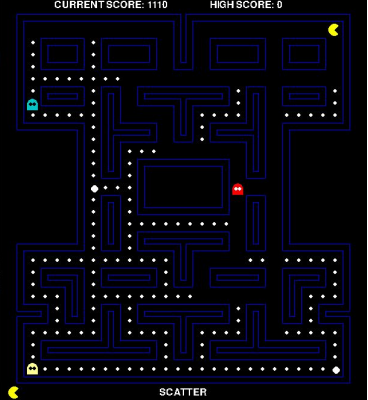

# Pacman

Projeto em Python(pygame) feito utilizando pathfinding A* para perseguição inteligente do personagem e máquina de estados para
a variação de estados do jogo, que influencia o comportamento dos inimigos.

## Como rodar o projeto:

 - pip install -r requirements.txt
 - python main.py

## Como jogar:

 - Movimentos se dão com as setas
 - Deve comer todas as bolinhas brancas
 - Tem 3 vidas